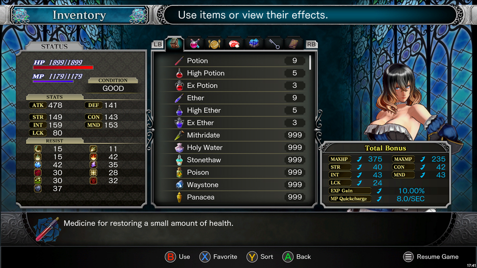

# Bloodstained: Ritual of the Night mods

- ### [Faster Movement Speed (multiple options)](./faster-movement-speed/readme.md)

  Increases base movement speed for Miriam to one of the following options: 1.5x / 1.25x / 1.125x.

  

- ### [Increased Stacks](./increased-stacks/readme.md)

  Increases the maximum amount of all stackable items to 999.  
  Includes two versions:

  - Cheat version - Includes HP/MP recovery items
  - Fair version - Excludes HP/MP recovery items

  

- ### [Invisible Passives](./invisible-passives/readme.md)

  Disables visual effects for the following shards:

  - Money is Power
  - Regenerate
  - Words of Wisdom

  
