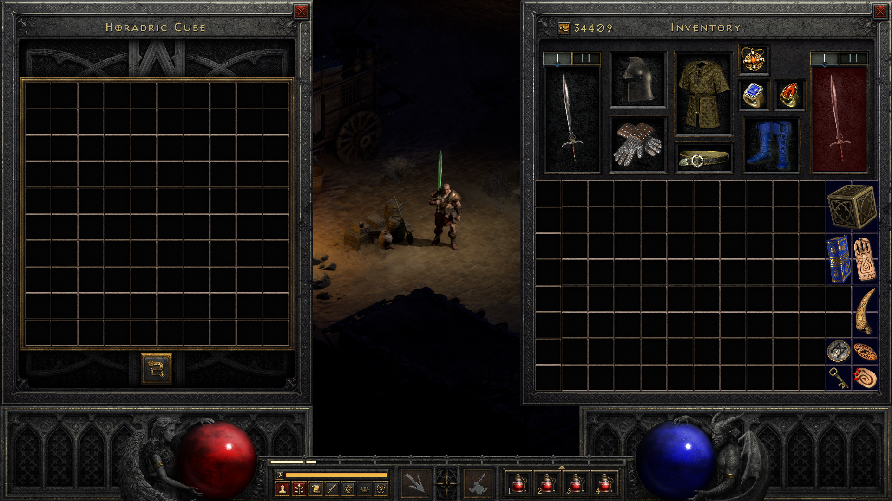
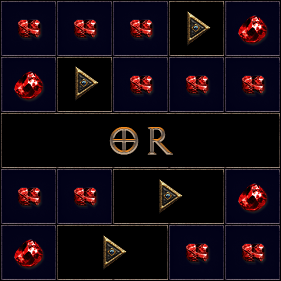
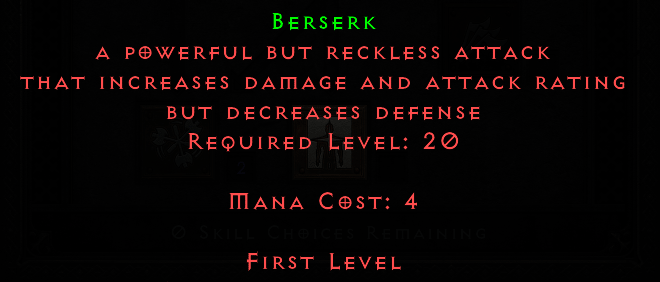
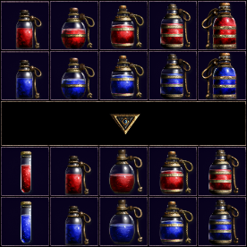
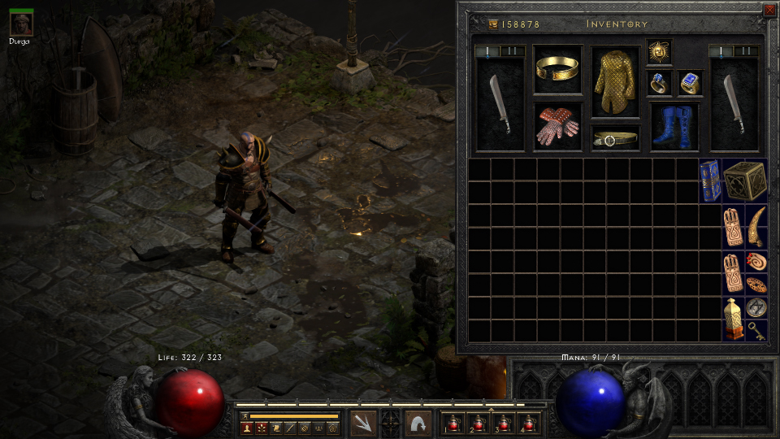
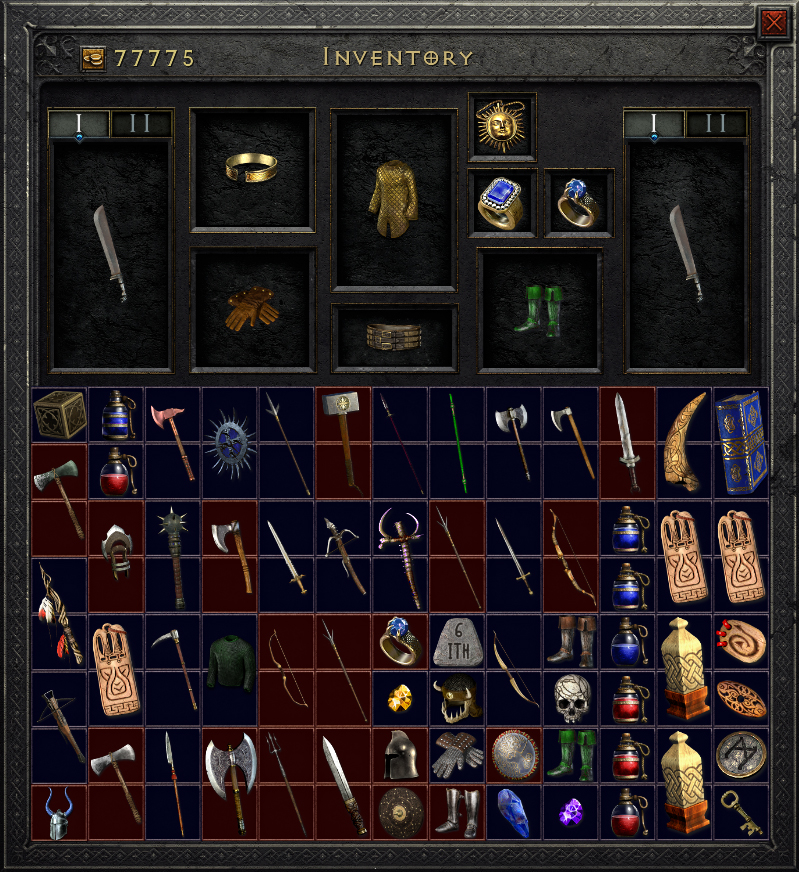
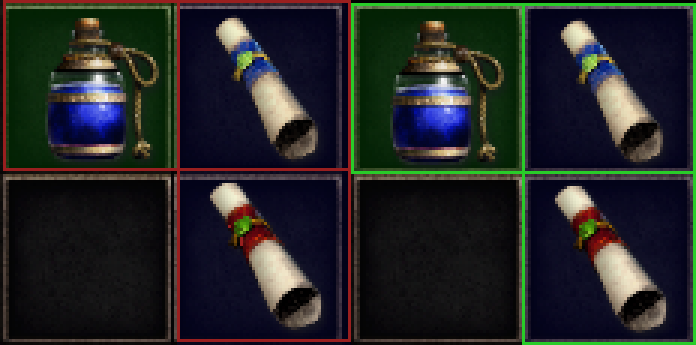

# Diablo II: Resurrected mods

- ### [10x10 Horadric Cube for D2RMM](./10x10Cube)

  Expands the Horadric Cube's grid size to 10x10.

  

- ### [Custom Gem Recipes](./CustomGemRecipes)

  Overrides the amount of gems required to upgrade to a higher tier.  
  Optionally, adds downgrade recipes with yet another configurable amount.  
  It does not affect the amount of gems required to transmute other items.

  

- ### [Custom Skill Level Requirements](./CustomSkillLevelRequirements)

  Applies a multiplier to skill level requirements, decreasing or increasing requirements as desired.

  

- ### [Custom Gem Recipes](./ImprovedPotionVisibility)

  Reshuffles and replaces potion textures to make them easier to tell apart.

  

- ### [Invisible Helmets](./InvisibleHelmets)

  Turns helmets invisble by scaling them down to 0.
  Only works on playable characters, by overriding the scale for each class to 0.
  Modifying the initial scale would make them invisible as well when dropped, so I don't think it would be possible to hide them for mercenaries too.

  

- ### [Selectively Disable Potion Drops](./SelectivelyDisablePotionDrops)

  Lets you disable drops of individual HP/MP/RV potions, by replacing them with gold drops.
  Does not affect fixed loot, such as sparkling chests or boses.

- ### [Smaller Grid Items](./SmallerGridItems)

  Scales down the space items take in the inventory to a maximum of two slots.  
  Has separate toggles for weapons, armor and miscellanous items. Mix as you please.  
  Works by scaling down the item sprites, so it only works for vanilla item sprites, so place mods that add item sprites after this one (otherwise the items will take less grid space while still using full sprites, causing issues).
  Affects all items bigger than two slots and, in addition, belts (to keep the gear scale more consistent).  
  The main drawback is **it reduces the max amount of sockets**, so don't use it if that's a deal breaker or use it only for the miscellaneous items.

  

- ### [UI Fixes](./UIFixes)

  Fixes the placement of a few item grids.
  Currently fixes:

  - (Vanilla) vendor panel layout
  - (Mod) Expanded Stash (16x13)

  Make sure the mod is loaded after the mods it fixes.

  
