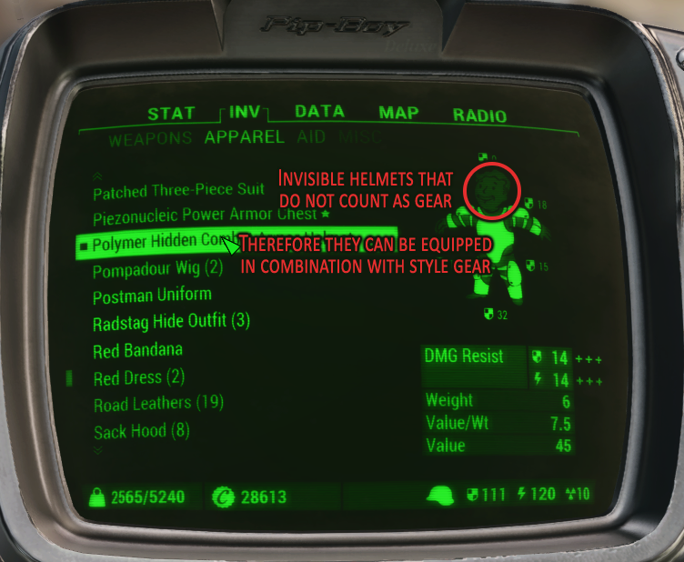
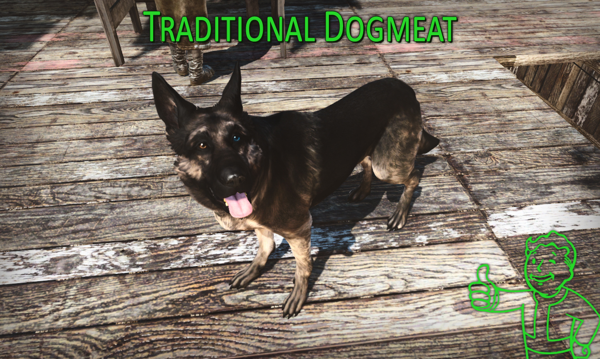

# FALLOUT 4 mods

- ### [Standalone Armor Outfits](./StandaloneArmorOutfits)

  I don't remember what this mod does; so take a wild guess.

- ### [Standalone Hidden Helmets](./StandaloneHiddenHelmets)

  Adds standalone invisible helmets for each in-game armor set and combinable S.P.E.C.I.A.L. enhancing armor pieces meant to replace hats so you can get the stat bonuses yet keep looking at your stylish character's face. Can be used too in combination with style gear.

  

- ### [Traditional Dogmeat](./TraditionalDogmeat)

  Recolored Dogmeat's default texture in an attempt to make it look closer to what he used to in Fallout 3.
  In other words, made its fur darker and less saturated and added eye heterochromia to it.

  
