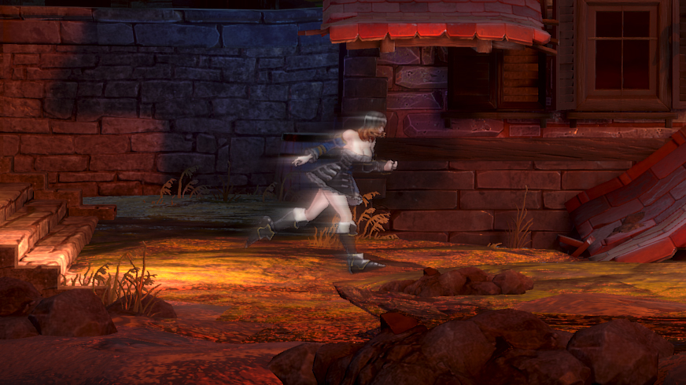

# Faster Movement Speed

## DESCRIPTION

Increases base movement speed for Miriam to 150% / 1.5x.  
Will stack with movement bonuses due to how the mechanics work.

## WARNING

As a result of the increased speed you might be able to reach early some places you wouldn't otherwise be able to, so bear it in mind if you want to prevent using that as a exploit.

## DISCLAIMER

Provided screenshot is not to be taken seriously, speed lines will (sadly) not display when Miriam moves.

## COMPATIBILITY

Will be incompatible with any mod updating file  
`Core\DataTable\PB_DT_EnchantaParameterInitialSetting.uasset`.

## CREDITS

Kudos to _ithinkandicode_ for his "Faster Movement" mod, which this one was based on.  
I simply changed the speed increase and repacked the file.
