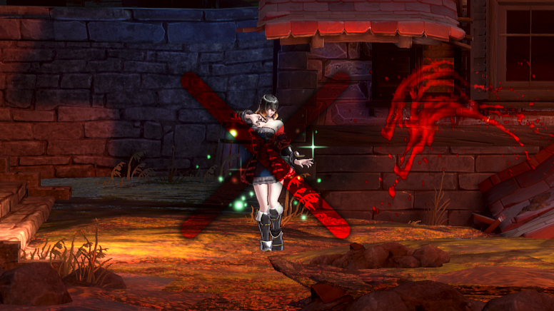

# Invisible Passives

## DESCRIPTION

Disables visual effects for the following shards:

- Words of Wisdom
- Regenerate

It will not disable visual effects for the following shards:

- Healing
  - disabling the effect for this shard results in the passive not working properly
- Detective's Eye
  - disabling the effect for this shard requires changing a different file; you can use _masamunedragon_'s "Invisible Detective Eye and Bloodsteal Rings" mod to achieve this

## COMPATIBILITY

Will be incompatible with any mod updating file  
`Core\DataTable\PB_DT_ShardMaster.uasset`.

## DISCLAIMER

The provided mod will also disable the voice line for Tis Rozain because both changes are done to the same file and I am too lazy to provide separate files.

## CREDITS

Kudos to _ashtar01_ for his "Words of Wisdom / Healing / Regenerate Invisible" mod, which this one was based on.
I simply reverted his removal of the effects for the healing shard in order to prevent a resulting bug that prevented it from working properly.
