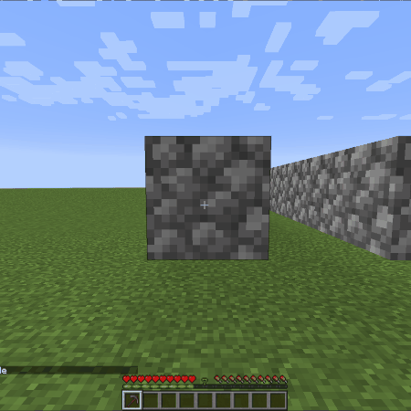
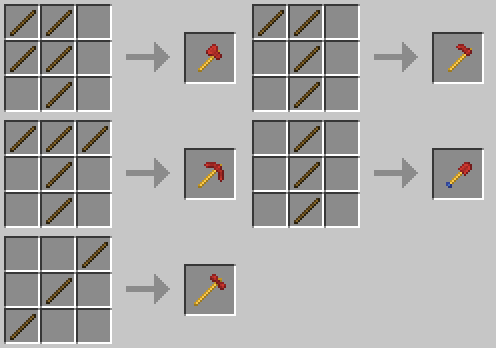

# Builder Tools Fabric Mod for Minecraft

## Description

Adds a new set of powerful wooden tools designed for building.  
The tools share most their stats with the vanilla wooden counterparts, but the breaking speed has been extremely increased and the durability has been set to the maximum.

## Recipes

## License

[CC BY-NC 2.0](https://creativecommons.org/licenses/by-nc/2.0/)

## Setup

For setup instructions please see the [fabric wiki page](https://fabricmc.net/wiki/tutorial:setup) that relates to the IDE that you are using.