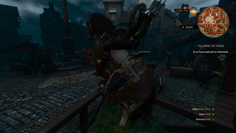
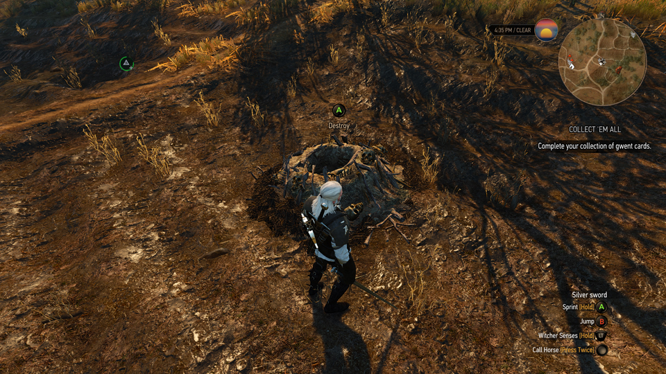
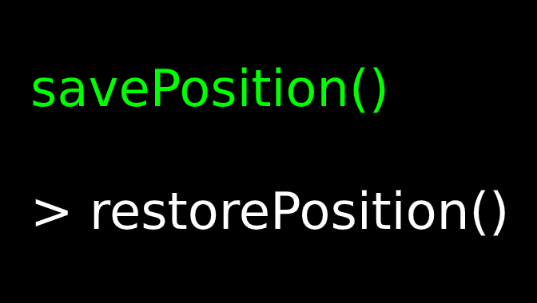

# Witcher 3 mods

## Contents

- ### [Fast Travel OnRoach](./modFastTravelOnRoach)

  Makes Geralt appear riding Roach when fast traveling, as if he traveled by horse instead of foot.
  Does not work when traveling between regions.

  

- ### [No Bombs Used To Destroy Nests](./modNoBombsUsedToDestroyNests)

  Removes the requirement of having bombs to destroy nests and also prevents their quantity from going down when doing so.

  

- ### [Teleport Commands](./modTeleportCommands/readme.md)

  Adds a few teleport commands; for convenience.

  
